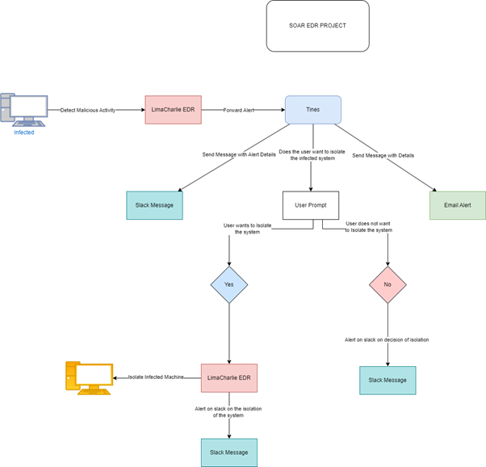

# EDR SOAR Automation Project

This **EDR SOAR Automation Project** creates an automated, scalable security operations workflow using **LimaCharlie**, **Tines**, and **Slack** to streamline incident detection, response, and alert management. This project provides a foundation for SOAR (Security Orchestration, Automation, and Response) capabilities within a SOC (Security Operations Center) environment, enabling timely and automated handling of security incidents and notifications.

## Project Overview

The project is organized into five main parts:

### 1. **Diagramming and Workflow Design**
   - Created a high-level workflow map that defines how detections, alerts, and responses flow through the automation system.
   - This design serves as the foundation for integrating the different tools used in subsequent phases.
   

### 2. **Setting Up Virtual Machines and Software Installation**
   - Set up a **Windows 10** virtual machine with **Sysmon** to capture system events for detection purposes.
   - Deployed **Wazuh** as the primary security analytics tool and **The Hive** for case management.
   - This environment generates realistic events, simulating a production SOC setup for testing purposes.

### 3. **Configuring Detections with LimaCharlie**
   - Built detection rules in **LimaCharlie** to identify suspicious behaviors, such as unauthorized credential access.
   - Configured detections to automatically trigger responses and notifications, creating the foundation for an automated incident response.

### 4. **Integrating Tines and Slack**
   - Configured **Tines** to receive detections from LimaCharlie and send notifications to **Slack**, organizing alerts in dedicated channels.
   - Set up automated email alerts and Slack notifications to ensure SOC analysts receive timely alerts for significant events.

### 5. **Automating Full Playbook for Incident Response**
   - Completed a fully automated playbook that can isolate compromised machines based on detection events in Tines.
   - Configured prompts for analyst discretion, allowing manual intervention when needed, while automating routine responses.

## Project Outcomes

- **Automation Across Tools**: Seamlessly connected LimaCharlie, Tines, and Slack for an integrated, automated incident response.
- **Analyst Notifications**: Configured structured notifications to ensure SOC analysts are alerted to critical incidents without manual oversight.
- **Scalable Framework**: Provides a flexible foundation for scaling SOAR automation by adding more detection rules and additional integrations.

This project demonstrates a robust SOAR capability, enabling SOCs to reduce response times and automate routine tasks, freeing analysts to focus on higher-priority security threats. It serves as a valuable example of how automation can enhance incident management, providing a structured workflow that can be expanded for larger-scale deployments.

Refer to this [Project Report](SOAR-EDR.pdf) for the Step Step guide to the project

---
